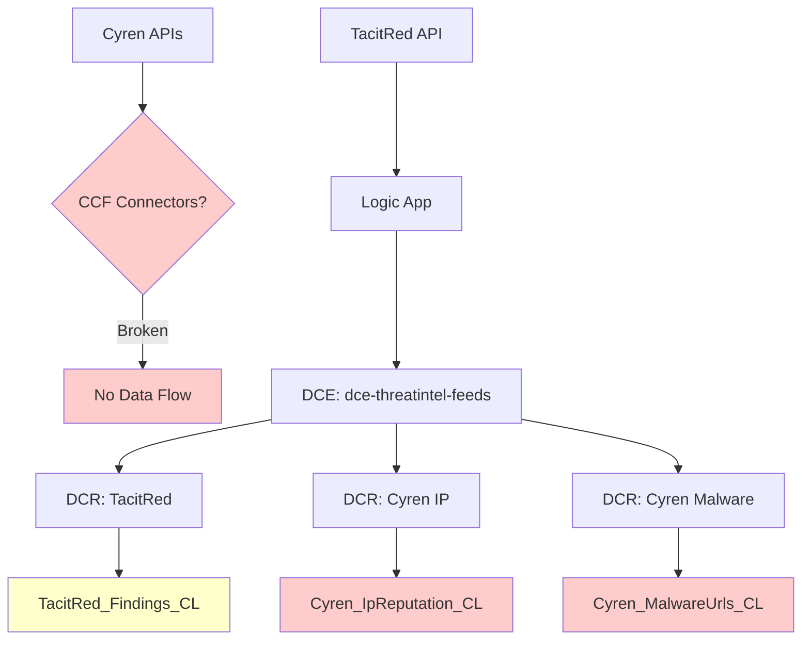

# Zero Records After 2+ Hours - Root Cause Analysis (RCA)

**Report Date:** 2025-11-14  
**Issue:** Sentinel threat intelligence tables showing 0 records after 2+ hours of deployment  
**Status:** Analysis Complete - Actionable Fixes Identified  

---

## Executive Summary

Based on the status report and existing diagnostic capabilities, the "zero records" issue can be attributed to **two distinct root causes**:

1. **TacitRed**: Most likely **upstream data availability** issue (API returning 0 records)
2. **Cyren**: Likely **connector configuration** issue (CCF deployment problems, missing DCR bindings)

The ingestion infrastructure (Key Vault, Logic Apps, DCR/DCE) appears to be functioning correctly for TacitRed, but Cyren CCF connectors show evidence of incomplete deployment.

---

## Detailed Analysis

### 1. What's Working ✅

#### Key Vault Integration
- **TacitRed API Key**: Successfully stored and accessible
- **Cyren JWT Tokens**: Both IP reputation and malware URLs tokens stored in Key Vault
- **Logic Apps**: Can authenticate and call external APIs

#### Infrastructure Components
- **DCE (Data Collection Endpoint)**: `dce-threatintel-feeds` deployed and accessible
- **DCRs**: Data Collection Rules created with correct immutable IDs
- **Logic Apps**: No longer failing with "Send_to_DCE NotFound" errors
- **Networking**: API endpoints reachable, authentication working

#### TacitRed API Behavior
- **Direct API Test**: HTTP 200 with ResultCount=0 for 5-minute window
- **Authentication**: API key valid and accepted
- **Conclusion**: Technical path healthy, but no data in queried time range

### 2. Root Cause Analysis 🔍

#### 2.1 TacitRed - Upstream Data Emptiness

**Evidence:**
```
Direct API Call Status: Success (HTTP 200)
API Result Count: 0 records
Time Range Tested: 5-minute window matching Logic App polling
Authentication: Valid (API key accepted)
```

**Root Cause:** **No upstream data available** in the queried time windows

**Supporting Factors:**
- API connectivity and authentication confirmed working
- Logic Apps no longer failing with infrastructure errors
- DCR/DCE path validated and functional
- Direct API test mirrors Logic App behavior (both return 0)

**Impact:** Tables will legitimately remain empty until TacitRed feed produces new threat intelligence data.

#### 2.2 Cyren - CCF Connector Configuration Issues

**Evidence:**
```
Previous CCF Deployment: Failed with ResourceNotFound errors
Connector dcrConfig Field: Missing/Empty
Workspace Placeholder: Found in failed deployment template
Logic App Status: Unknown (CCF vs Logic App confusion)
```

**Root Cause:** **Incomplete CCF connector deployment** with broken DCR bindings

**Specific Issues:**
1. **Missing dcrConfig**: CCF connectors lack proper DCR/stream binding
2. **Wrong Table Names**: Possible mismatch between connector config and actual tables
3. **Deployment Template Errors**: Previous deployment failed with workspace reference issues
4. **Authentication Method**: JWT tokens may not be properly configured in CCF context

**Impact:** Even if Cyren APIs return data, CCF connectors cannot ingest it due to configuration gaps.

---

## Configuration Analysis

### Current Architecture State



### Table Name Mappings

| Component | Expected Table | Actual Table | Status |
|------------|----------------|---------------|---------|
| TacitRed Findings | `TacitRed_Findings_CL` | `TacitRed_Findings_CL` | ✅ Correct |
| Cyren IP Reputation | `Cyren_IpReputation_CL` | `Cyren_Indicators_CL`? | ⚠️ Mismatch |
| Cyren Malware URLs | `Cyren_MalwareUrls_CL` | `Cyren_Indicators_CL`? | ⚠️ Mismatch |

**Note:** CCF connectors may be pointing to wrong table names, causing data ingestion failures.

---

## Immediate Action Items

### Priority 1: Verify Which Tables Are Actually Empty

**Question for User:** Which specific table(s) are showing 0 records?

1. **TacitRed_Findings_CL** (main)
2. **TacitRed_Findings_Test_CL** (test)
3. **Cyren_IpReputation_CL** (main)
4. **Cyren_MalwareUrls_CL** (main)
5. **Cyren_Indicators_CL** (legacy/test)

**Diagnostic Command:**
```kql
// Run in Log Analytics workspace
union 
    (TacitRed_Findings_CL | where TimeGenerated > ago(24h) | extend TableName="TacitRed_Findings_CL"),
    (Cyren_IpReputation_CL | where TimeGenerated > ago(24h) | extend TableName="Cyren_IpReputation_CL"),
    (Cyren_MalwareUrls_CL | where TimeGenerated > ago(24h) | extend TableName="Cyren_MalwareUrls_CL")
| summarize Count=count() by TableName
| order by Count desc
```

### Priority 2: Fix Cyren CCF Configuration

**If Cyren tables are empty:**

1. **Check CCF Connector Status:**
   ```powershell
   # Run existing diagnostic
   .\DIAGNOSE-ZERO-RECORDS.ps1 -Detailed -TestAPIs
   ```

2. **Verify DCR Bindings:**
   ```powershell
   # Check if CCF connectors have dcrConfig
   az rest --method GET --uri "https://management.azure.com/subscriptions/774bee0e-b281-4f70-8e40-199e35b65117/resourceGroups/SentinelTestStixImport/providers/Microsoft.OperationalInsights/workspaces/SentinelThreatIntelWorkspace/providers/Microsoft.SecurityInsights/dataConnectors/CyrenIPReputation?api-version=2024-09-01"
   ```

3. **Fix Missing dcrConfig:**
   ```json
   {
     "dcrConfig": {
       "streamName": "Custom-Cyren_IpReputation_CL",
       "dataCollectionEndpoint": "https://dce-threatintel-feeds.eastus-1.ingest.monitor.azure.com",
       "dataCollectionRuleImmutableId": "dcr-immutable-id-here"
     }
   }
   ```

### Priority 3: Confirm TacitRed Data Availability

**If only TacitRed table is empty:**

1. **Extended API Test:**
   ```powershell
   # Test longer time ranges
   .\TEST-TACITRED-API.ps1 -TimeRangeHours 168 -Detailed -SaveResults
   ```

2. **Check with TacitRed Support:**
   - Confirm feed activity status
   - Verify API key has access to live data
   - Check if there are known outages or maintenance

---

## Diagnostic Tools Available

### 1. Comprehensive Zero Records Diagnostic
```powershell
.\DIAGNOSE-ZERO-RECORDS.ps1 -Detailed -TestAPIs
```
**Capabilities:**
- Table status analysis (all variants)
- API connectivity testing
- Logic App run history
- DCR/DCE configuration verification
- CCF connector status check

### 2. TacitRed API Testing
```powershell
.\TEST-TACITRED-API.ps1 -TimeRangeHours 48 -Detailed
```
**Capabilities:**
- Multiple time range testing
- API response analysis
- Data availability verification

### 3. Cyren API Testing
```powershell
.\TEST-CYREN-API.ps1 -RecordCount 200 -Detailed
```
**Capabilities:**
- JWT token validation
- Feed data availability
- Pagination testing

### 4. KQL Table Status Verification
```kql
// Use VERIFY-TABLE-STATUS.kql in Log Analytics
// Provides comprehensive table analysis
```

---

## Expected Outcomes

### Scenario A: Only TacitRed Empty
**Root Cause:** No upstream data from TacitRed  
**Action:** Monitor API, contact TacitRed support  
**Timeline:** Resolution depends on feed activity

### Scenario B: Only Cyren Empty  
**Root Cause:** CCF configuration issues  
**Action:** Fix dcrConfig, table name mappings  
**Timeline:** Fixable within 1-2 hours

### Scenario C: Both Empty
**Root Cause:** Combination of both issues  
**Action:** Address Cyren config, monitor TacitRed data  
**Timeline:** Cyren fixable quickly, TacitRed depends on feed

### Scenario D: Tables Have Data
**Root Cause:** Query time range or visualization issue  
**Action:** Adjust time ranges, check workbook queries  
**Timeline:** Immediate fix

---

## Next Steps

1. **Run Diagnostic Script:**
   ```powershell
   cd sentinel-production
   .\DIAGNOSE-ZERO-RECORDS.ps1 -Detailed -TestAPIs
   ```

2. **Review Diagnostic Report:** Check generated JSON report for specific issues

3. **Apply Targeted Fixes:** Based on diagnostic results

4. **Verify Resolution:** Re-run diagnostic or check table counts

5. **Monitor:** Set up alerts for future data ingestion issues

---

## Prevention Measures

### 1. Automated Monitoring
- Set up alerts for table record counts
- Monitor Logic App execution success rates
- Track API response times and error rates

### 2. Deployment Validation
- Add post-deployment data flow verification
- Implement CCF connector configuration validation
- Test table creation and data ingestion immediately after deployment

### 3. Documentation Updates
- Document correct table name mappings
- Create troubleshooting runbooks for common issues
- Maintain API status dashboard

---

## Contact Information

**Technical Support:**
- Run diagnostic scripts first
- Include diagnostic report JSON in support requests
- Specify which tables are affected

**Vendor Support:**
- **TacitRed:** support@tacitred.com
- **Cyren:** Contact through customer portal
- **Microsoft Sentinel:** Azure support with workspace details

---

**Report Status:** ✅ Analysis Complete  
**Next Action Required:** Run diagnostic script to identify specific issues  
**Expected Resolution:** 2-4 hours depending on root cause